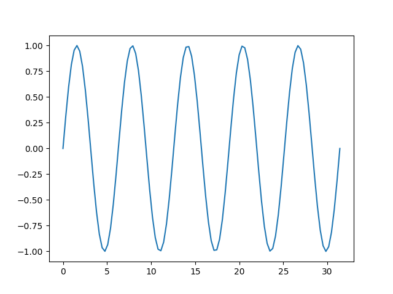
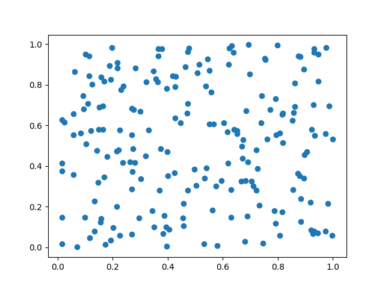
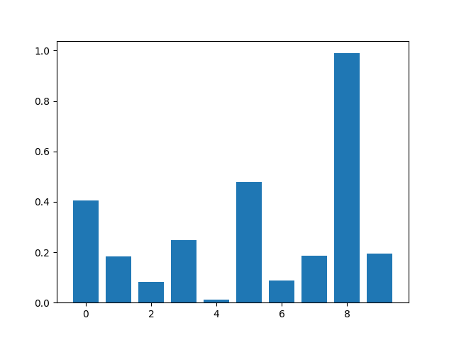
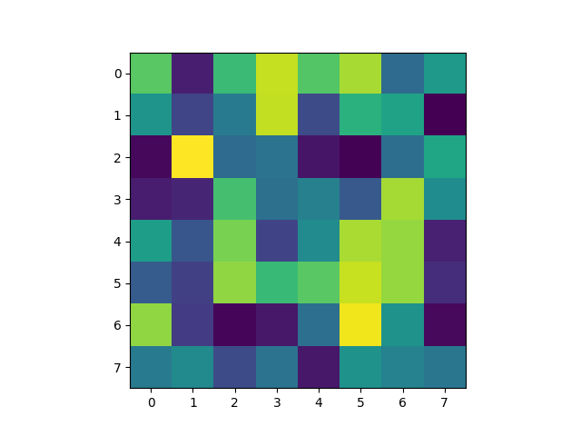
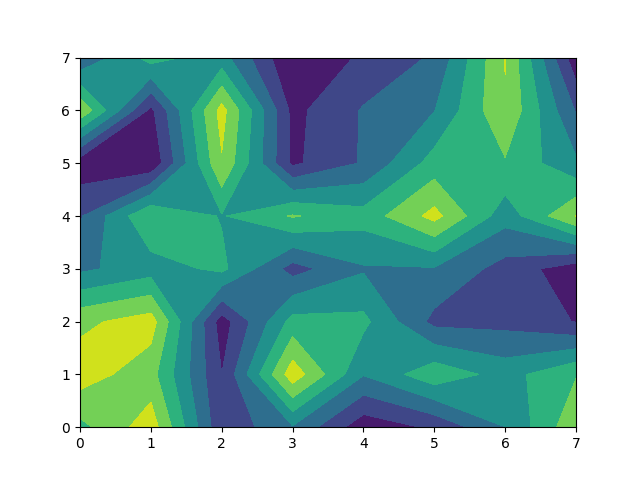
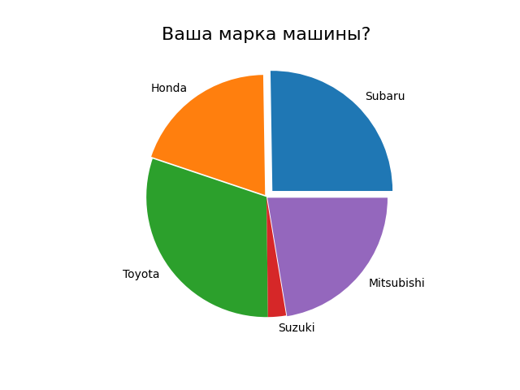
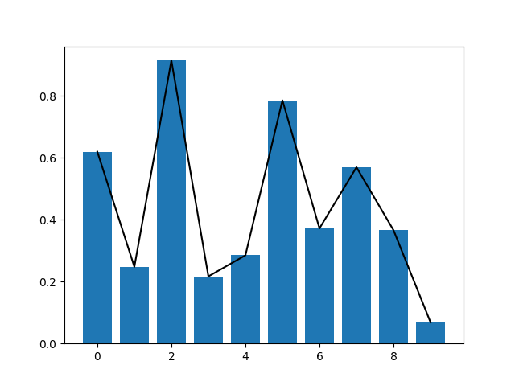
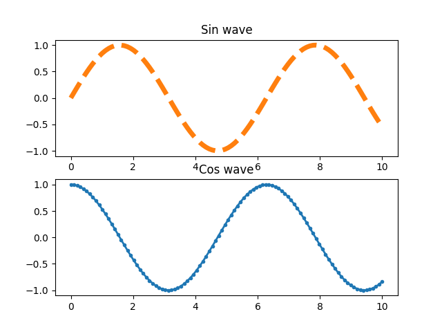
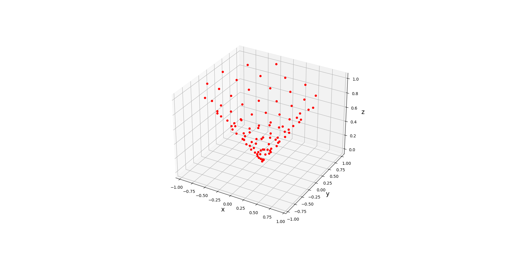

# Сравнение различных библиотек для визуализации данных: Matplotlib, Seaborn и Plotly:

## Содержание
1. [Задачи проекта](#1)
2. [Описание проекта](#2)
3. [Установка](#3)
4. [Реализация проекта](#4)
   - [Библиотека Matplotlib](#4.1)
   - [Библиотека  Seaborn](#4.2)
   - [Библиотека Plotly](#4.3)
5. [Сравнение бибилиотек Matplotlib, Seaborn и Plotly](#5)


<a id="1"></a>
## Задачи проекта
Этот проект предназначен для сравнения трех популярных библиотек Python для визуализации данных: Matplotlib, Seaborn и Plotly.
В ходе реализации проекта рассмотрим основной функционал библиотек, область применения, преимущества и недостатки. 


<a id="2"></a>
## Описание проекта
В рамках реализации проекта рассмотрим базовый функционал визуализации каждой из библиотек.  


<a id="3"></a>
## Установка
Для установки проекта необходимо выполнить установку библиотек. Её можно выполнить по следующей команде:
```sh
pip install -r requirements.txt.
```

<a id="4"></a>
## Реализация проекта

<a id="4.1"></a>
## Библиотека Matplotlib

Matplotlib, наверное, самая популярная библиотека для визуализации данных в Python. Она используется для создания любых видов графиков: линейных, круговых, столбчатых диаграмм, а также есть возможность реализации - 3D-граффики. Условно, можно разбить Matplotlib на 2 модуля: PyPlot и PyLab. При этом PyLab в большей степени отвечает за взаимодействие рендера с датафреймом, PyPlot же осуществляет непосредственное построение осей, фигур и иных элементов, а также 
позволяет комбинировать фигуры, выборочно меняя их свойства и отображение.


### В ходе рассмотрения нами будут пройдены 4 этапа работы с функционалом библиотеки:
  - Инициализация.
	Подключаем библиотеку и импортируем все необходимые зависимости.
```python
import numpy as np
import matplotlib.pyplot as plt
```
  - Подготовка.
	Обозначаем оси, задаем вводные данные.
```python
x = np.linspace(0, 10*np.pi, 100)
y = np.sin(x)
```
  - Отрисовка.
	Указываем размер, тип и особенности отображения фигуры на основе вводных данных.
```python
fig, ax = plt.subplots() 
ax.plot(x, y)
```
  - Наблюдение.
	Изучаем построенную фигуру.
```python
plt.show()
```


### По такому принципу строятся все базовые визуализации библиотеки, такие как:
 - Диаграмма рассеяния

```python
x = np.random.uniform (0, 1, 1000)
y = np.random.uniform (0, 1, 1000)
ax.scatter(x,y)
```
 - Гистограмма

```python
x = np.arange (10)
y = np.random.uniform (0, 1, 10)
ax.bar(x,y
```
 - 'Тепловая карта'

```python
z = np.random.uniform (0, 1, (8,8))
ax.imshow(z)
```
 - Контурная визуализация тепловой карты

```python
z = np.random.uniform (0, 1, (8,8))
ax.contourf(z)
```
 - Круговая диаграмма

```python
z = np.random.uniform (0, 1, 5)
label = ['Subaru', 'Honda', 'Toyota', 'Suzuki', 'Mitsubishi']
exp = [0.07, 0.02, 0, 0, 0.01]
fig, (ax) = plt.subplots()
plt.title('Ваша марка машины?', fontsize=16)
ax.pie(z, labels=label, explode=exp).
```
Стоит отметить богатый функционал объектно-ориентированного подхода. Без использования сторонних возможностей мы можем форматировать отображаемые данные:
 - объединяя несколько отображений для повышения информативности 

```python
#Вариант компиляции 1
x = np.arange (10)
y = np.random.uniform (0, 1, 10)
ax.plot(x,y, color = 'green')
ax.bar(x,y)
```
 - или разнести их по разным полям отображения, изменяя стили, цвет и виды элементов построения.

```python
x=np.linspace(0, 10, 100)
y1, y2 = np.sin(x), np.cos(x)
fig, (ax1, ax2) = plt.subplots(2, 1)
ax1.set_title('Sin wave')
ax2.set_title('Cos wave')
ax1.plot(x, y1, color='C1', label='Sin', lw=5, linestyle='--')
ax2.plot(x, y2, color='C0', label='Cos', lw=2, marker='.')
```
Работа с 3D изображением, также встроена в библиотеку.

```python
f = plt.figure(figsize=(15, 10))
ax_3d = f.add_subplot(projection='3d')
z = np.linspace(0, 1, 100)
x = z * np.sin(50 * z)
y = z * np.cos(50 * z)
ax_3d.scatter(x, y, z, color='red', alpha=1)
ax_3d.set_xlabel('x', size='15')
ax_3d.set_ylabel('y', size='15')
ax_3d.set_zlabel('z', size='15')
```

 

[Описание](ссылка)
если после запятой в ссылке добавить описание, оно будет всплывающим
``` вставка кода```
